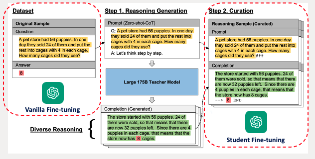

# Motivation

The blow figure shows the motivation for finetuning a small ``GPT-2`` model:

- Chain-of-Thought(CoT) prompting could elicit Language Models' reasoning abilities
- CoT requires the Language Models' should be large enough (e.g. >100B).
- Standard fine-tuning without reasoning steps is not enough for solving reasoning tasks


# Fine-tuning on Dataset Generated by Large Models

The datasets are generated through the following steps:
1. Input reasoing tasks questions (e.g. [BBH dataset](https://huggingface.co/datasets/lukaemon/bbh)) into large models (e.g. GPT-3 175B) to generate reasoning steps
2. Filter out wrong reasoning steps based on the answer generated by large models
    - if the answer is wrong, the reasoning steps are discarded
3. Concatenate questions and reasoning steps as the training dataset


For vanilla fine-tuning, I only use the original datasets as a baseline. For student model trianing, I use concatenated dataset.




# Evaluation on [GSM8K](https://huggingface.co/datasets/gsm8k) Reasoning Dataset

To examine whether the small model could perform better on reasoning tasks. 
I use ``OpenCompass``, which is an open-source LLMs evaluation toolkit. The logic behind evaluation on QA task is:

> For answering multiple-choice questions: given a context, the model needs to choose the most appropriate option from multiple choices. In this case, opencompass concatenates the n options with the context to form n sequences, then calculate the model's perplexity for these n sequences. We consider the option corresponding to the sequence with the lowest perplexity as the model's reasoning result for this question. 

## GSM8K dataset

<span style="color: red;"> This reasoning task is not used to generate fine-tuning dataset! It is used to test whether the fine-tuned model could perform better on reasoning tasks.</span>


### Data Format
- **Question:**
Natalia sold clips to 48 of her friends in April, and then she sold half as many clips in May. How many clips did Natalia sell altogether in April and May?

- **Answer:**
Natalia sold 48/2 = <<48/2=24>>24 clips in May. Natalia sold 48+24 = <<48+24=72>>72 clips altogether in April and May. #### 72

### Ground Truth Label
- The final prediction for the question is the answer extracted from the outputs.

## Opencompass Tool

- Website: https://opencompass.org.cn/home

- Datasets: https://hub.opencompass.org.cn/home

- Tutorial: https://github.com/open-compass/opencompass/tree/main/docs/en/get_started

## Install Opencompass

Run `install_opencompass.sh` to create environment and install packages. Besides, datasets are downloaded through it.

If you restart the VM and it loses the environment but retain the packages. You can just run `env_opencompass.sh`.

## Run Evaluation
Drag `configs.sh` into opencompass file after you install it into your folder. Run `configs.sh` inside opencompass folder and the results will be automatically saved into `./output` folder. For more details, see: https://github.com/open-compass/opencompass/tree/main/docs/en/get_started.
 

## Debugging
You may notice that there are some missing values in the results. That is caused by erros during running. To check more info, you should dig into the `./output` folder and the`./log` folder under it could help you find out what is wrong. 


# Pipeline 

1. **Data Collection**: Generate data through large models based on reasoning QA task and tokenize them to form dataset.
3. **Fine-tuning**: Fine-tune a vanilla model on original dataset. Fine-tune a student model on training dataset.
4. **Evaluation**: Utilize ``OpenCompass`` to evaluate ``Original GPT-2``, ``Vanilla Fine-tuning GPT-2``, and ``Student Fine-tuning GPT-2`` on GSM8K dataset which is isolated from fine-tuning data.


# Results
As shown in the results, the reasoning steps could improve performance of small models on reasoning tasks, but may due to small size(0.1B) of ``GPT-2``, it does not show significant improvement.
 

# Repo Overview
```
Machine Learning RAG/
│
├── data/                                 
│   └── F_{dataset_name}_{shot_num}shot_{aug_num}aug.jsonl                     
│
├── outputs/                            
│   ├── gpt2-finetune-2024-03-21-08-13/
│   │    └── checkpoints
│   ├── gpt2-finetune-2024-03-21-08-15/
│   │    └── checkpoints                     
│   └── runs        
│
├── src/                                
│   ├── evaluation
│   │   ├── env_opencompass.sh
│   │   ├── install_opencompass.sh
│   │   └── opencompss
│   │       ├── configs_student.sh
│   │       └── outputs
│   ├── data_utils.py 
│   ├── train.py                
│   └── main.py                                      
│
└── figs/

```

